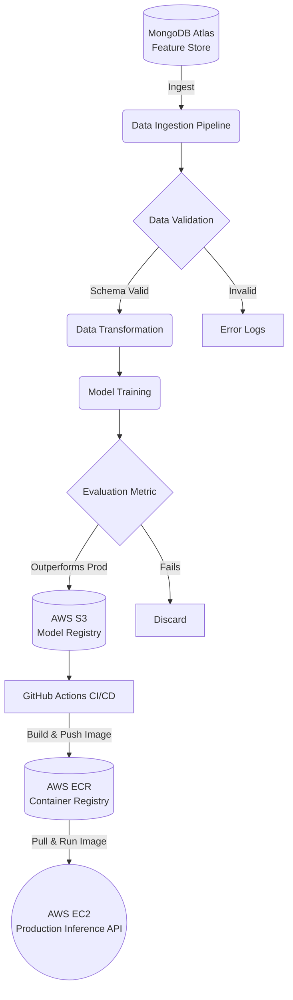

# 🛡️ Vehicle Insurance MLOps Pipeline

### End-to-End Production ML Architecture

    

An automated, production-ready Machine Learning Operations (MLOps) pipeline designed to ingest, process, train, and deploy predictive models for vehicle insurance data. 

Unlike static Jupyter Notebook models, this system is built for continuous integration and continuous deployment (CI/CD), featuring automated data validation, cloud-based model registries, and containerized serving infrastructure.

## 🏗️ System Architecture

This pipeline is built on a decoupled, component-based architecture ensuring scalability and fault tolerance at every stage of the ML lifecycle.


* **Data Ingestion & Store:** Live data is streamed and fetched from a MongoDB Atlas cluster, acting as the centralized feature store.
* **Validation & Transformation:** Automated schema validation using custom configurations, followed by robust feature engineering and scaling pipelines.
* **Model Training & Evaluation:** Automated training loops with built-in model evaluation. New models are only promoted if they outperform the current production model.
* **Model Registry (AWS S3):** Production-approved models and their associated preprocessing artifacts are versioned and pushed to AWS S3 for secure storage and rollback capabilities.
* **Deployment (Docker + AWS EC2):** The inference API is containerized using Docker and pushed to the AWS Elastic Container Registry (ECR).
* **CI/CD (GitHub Actions):** Every merge to the `main` branch triggers a GitHub Actions workflow that automatically builds the new Docker image, pushes it to ECR, and triggers a rolling deployment on a self-hosted AWS EC2 instance.

## 🛠️ Technology Stack

* **Core Logic:** Python 3.10
* **Database:** MongoDB Atlas
* **Cloud Infrastructure:** AWS (S3, EC2, ECR, IAM)
* **Containerization:** Docker
* **CI/CD Orchestration:** GitHub Actions
* **API Framework:** Flask / FastAPI (Serving Layer)

## 🚀 Running the System Locally

To test the complete pipeline on a local machine (requires AWS credentials and MongoDB URI):

```bash
# 1. Clone & Setup Environment
git clone https://github.com/DHRUVBSTHAKUR/MLOPS-VEHICLE-INSURANCE.git
cd MLOPS-VEHICLE-INSURANCE
conda create -n vehicle python=3.10 -y
conda activate vehicle

# 2. Install Dependencies
pip install -r requirements.txt

# 3. Export Required Environment Variables
export MONGODB_URL="mongodb+srv://<username>:<password>@cluster.mongodb.net/..."
export AWS_ACCESS_KEY_ID="your_access_key"
export AWS_SECRET_ACCESS_KEY="your_secret_key"
export AWS_DEFAULT_REGION="us-east-1"

# 4. Trigger the Pipeline
python demo.py # Executes the full ingestion-to-evaluation pipeline
# or 
python app.py  # Spools up the local serving API
